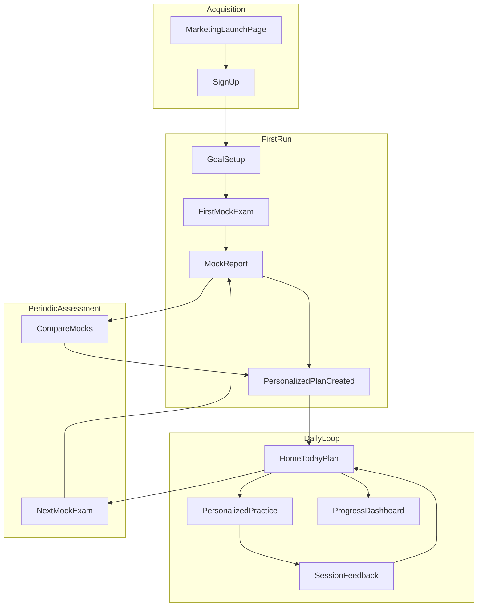
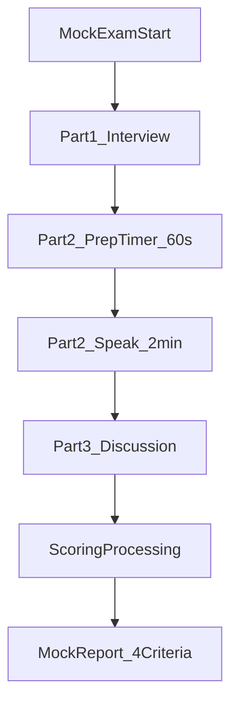
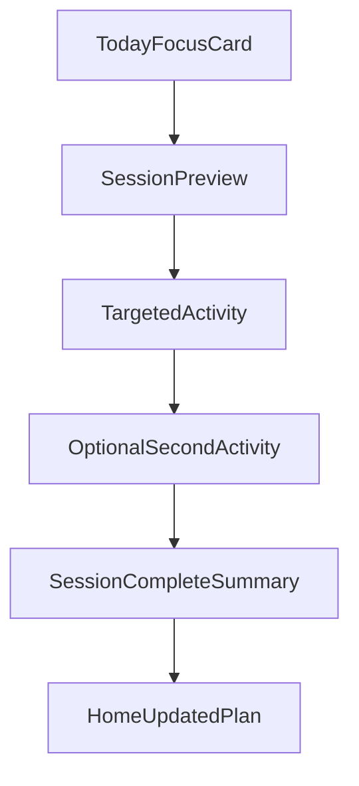
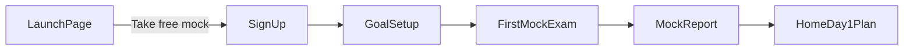

# SpeakLab — Product Flows

Working product name: **SpeakLab** (placeholder — swap when brand is chosen).

This document defines the core user flows for the student-first IELTS speaking prep app (AI video examiner, personalized practice from mock exams).

---

## A. End-to-end product loop

### Loop summary

| Phase | Entry | Exit |
|-------|-------|------|
| **Acquisition** | Marketing launch page | Signed-up account |
| **First run** | Goal setup | Personalized plan created from Mock #1 |
| **Daily loop** | Home (today's plan) | Session feedback → updated home |
| **Periodic assessment** | Next mock (when plan milestones met) | Updated plan from compare view |

---

## B. Mock exam flow (Parts 1–3, AI video)

### Part details

| Step | Duration | Behavior |
|------|----------|----------|
| **Part 1 — Interview** | 4–5 min | Warm-up + familiar topics (home, work, hobbies). Examiner asks; student answers. |
| **Part 2 — Prep** | 60 s | Cue card shown. Notes area available. Examiner in listening mode. |
| **Part 2 — Speak** | 1–2 min | Monologue on cue card topic. 2-min progress indicator. |
| **Part 3 — Discussion** | 4–5 min | Abstract follow-ups linked to Part 2 topic. Dynamic examiner questions. |
| **Processing** | ~15–30 s | Transcript + scoring on 4 IELTS criteria. |
| **Report** | — | Overall band + Fluency, Lexical resource, Grammar, Pronunciation. Feeds plan. |

### ConversationShell (shared across parts)

Each part uses the same **ConversationShell**:

- Tavus video examiner + turn states (connecting → examiner speaking → your turn → processing)
- Timers where applicable (prep, speak length)
- **Exam mode:** no hints, minimal on-screen question text during listen (questions heard, not read)

---

## C. Personalized practice session flow

### Plan inputs (from mock exam)

Personalization engine uses:

- **Weakest criterion** — e.g. Lexical resource 5.0
- **Weakest part** — e.g. Part 2 (short answers, lost coherence)
- **Recurring mistake tags** — e.g. short Part 2, basic vocabulary, frequent pauses

### Practice vs exam mode

| Mode | When | UX |
|------|------|-----|
| **Practice** | Daily personalized sessions | Hints allowed, feedback after each activity, pause/replay OK |
| **Exam** | Full mock | Timed, sequential, no hints, report at end |

---

## D. Launch page → app handoff

Signup collects minimum: **email**, **target band** (optional), **exam date** (optional) — feeds personalization later.

See [launch-page.md](./launch-page.md) for marketing page spec and [day-1-screens.md](./day-1-screens.md) for the first day after Mock #1.
