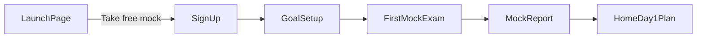

# SpeakLab — Marketing Launch Page

Working product name: **SpeakLab** (placeholder — swap when brand is chosen).

Content and layout spec for a **single-page marketing site** (pre-signup). Implement later as `/` in Lovable/React.

---

## Page goal

Convert IELTS speaking candidates (18–30, English learners) to **Take your free mock** — not "browse features."

**Primary CTA (repeat 3×):** Take your free mock

**Secondary CTA:** Get started (pricing section)

---

## Section order (top → bottom)

### 1. Hero

| Element | Copy |
|---------|------|
| **Headline** | Practice IELTS Speaking with a real AI examiner |
| **Subheadline** | Face-to-face video practice for Parts 1, 2, and 3. Get a band score and a plan built from your mock. |
| **CTA** | Take your free mock |
| **Visual** | Hero mock: mobile frame with video examiner + subtle Part 2 cue card overlay |

---

### 2. Social proof strip

| Element | Copy |
|---------|------|
| **Line** | Built for IELTS · Official 4 criteria · AI video |
| **Badges** | IELTS Parts 1–3 · Fluency · Vocabulary · Grammar · Pronunciation · Student-first |
| **Note** | Use "Tavus-powered video" only if partnership/attribution allows |

---

### 3. Problem

| Element | Copy |
|---------|------|
| **Headline** | The speaking test is the one you can't cram |
| **Body** | The IELTS Speaking test is an 11–14 minute face-to-face interview. There is no text to read. The examiner listens, follows up, and reacts to what you say. Reading sample answers won't prepare you for that. |
| **CTA** | — |

---

### 4. How it works

| Element | Copy |
|---------|------|
| **Headline** | How it works |
| **Step 1** | **Take a full mock** — Parts 1, 2, and 3 with an AI video examiner, just like test day. |
| **Step 2** | **See your band on 4 criteria** — Fluency, Lexical resource, Grammar, and Pronunciation. |
| **Step 3** | **Follow your daily plan** — Practice targets your weak areas from each mock. |
| **CTA** | Take your free mock |

---

### 5. Differentiator

| Element | Copy |
|---------|------|
| **Headline** | Not audio flashcards — a person asks you questions |
| **Body** | SpeakLab puts you in a video conversation with an AI examiner. You hear the question, you answer out loud, and you get feedback on what you actually said — not a multiple-choice guess. |
| **Visual** | Short loop or static mock: examiner video + student camera placeholder + Part 2 cue card |
| **CTA** | — |

---

### 6. Personalization

| Element | Copy |
|---------|------|
| **Headline** | Every mock updates your plan |
| **Body** | After each mock, SpeakLab finds your weakest criterion and part. Your daily sessions focus there — Part 2 cue cards if you run short, Part 3 discussions if abstract answers are hard, vocabulary drills if lexical resource is low. |
| **Visual** | Simple diagram: Mock → Weak areas → Today's plan |
| **CTA** | — |

---

### 7. Mock vs Practice

| Element | Copy |
|---------|------|
| **Headline** | Exam mode when you're ready. Practice when you're learning. |

| | **Mock exam** | **Practice** |
|---|---------------|--------------|
| **Purpose** | Simulate test day | Build specific skills |
| **Format** | Full Parts 1–3, timed | Targeted activities from your plan |
| **Hints** | None | Scaffolds and feedback after each turn |
| **Output** | Band report + new plan | Session summary + tomorrow's focus |

| **CTA** | — |

---

### 8. For students

| Element | Copy |
|---------|------|
| **Headline** | Built for learners, not parents |
| **Body** | Plain English UI. Encouraging feedback — not red marks on every mistake. Mobile-first so you can practice between classes. Parents can get progress summaries; the app is for you. |
| **CTA** | — |

---

### 9. Pricing teaser

| Element | Copy |
|---------|------|
| **Headline** | Start with a free mock |
| **Body** | Your first full mock and band report are free. Unlock unlimited practice and mock exams with a plan — pricing TBD for launch. |
| **CTA** | Get started |

*Hackathon note: keep pricing simple; link CTA to signup, not a payment flow.*

---

### 10. FAQ

| Element | Copy |
|---------|------|
| **Headline** | Frequently asked questions |

**Q: Is this like the real IELTS Speaking test?**  
A: We simulate the same three-part structure, timing, and face-to-face format. The AI examiner asks follow-up questions and does not show you text to read during Parts 1 and 3 — similar to the real test.

**Q: How is my band score calculated?**  
A: Your mock is scored on the four official IELTS Speaking criteria: Fluency and coherence, Lexical resource, Grammatical range and accuracy, and Pronunciation.

**Q: Do I need a camera and microphone?**  
A: Yes. Speaking practice requires a microphone. A camera is recommended for the video examiner experience and to build comfort speaking on camera.

**Q: Can I practice only Part 2?**  
A: Your daily plan is personalized from your mocks, but you can explore practice by part anytime after signup.

**Q: Who is SpeakLab for?**  
A: English learners preparing for IELTS Speaking — especially students who want realistic practice without booking a human tutor for every session.

**Q: Is SpeakLab affiliated with IELTS?**  
A: No. SpeakLab is independent prep practice. IELTS is a registered trademark of its owners.

| **CTA** | — |

---

### 11. Footer CTA

| Element | Copy |
|---------|------|
| **Headline** | Your next mock is 14 minutes away |
| **Subheadline** | Sign up, take your free mock, and get a plan built for you. |
| **CTA** | Take your free mock |

**Footer links:** Privacy · Terms · Contact (placeholders)

---

## Visual direction

| Token | Guidance |
|-------|----------|
| **Tone** | Calm, confident, modern — not corporate test-prep blue |
| **Background** | Neutral light (e.g. off-white / warm gray) |
| **Accent** | One color for CTAs and progress accents (e.g. teal or soft coral — pick one) |
| **Text** | High contrast; body 16px+ |
| **Typography** | Single sans-serif — Inter or Plus Jakarta Sans |
| **Imagery** | Video examiner frame + mobile mock UI; avoid stock graduation photos |
| **CTA buttons** | Full-width on mobile; clear hover/active states on desktop |

### Design tokens (for implementation)

```
--color-bg: neutral-50
--color-text: neutral-900
--color-text-muted: neutral-600
--color-accent: [TBD — one primary]
--color-accent-hover: [TBD — darker shade]
--font-sans: Inter, system-ui, sans-serif
--radius-button: 8px
--spacing-section: 64px (mobile) / 96px (desktop)
```

---

## Launch page → app handoff



### Signup fields (minimum)

| Field | Required | Purpose |
|-------|----------|---------|
| Email | Yes | Account |
| Password | Yes | Account |
| Target band | No | Personalization / goal display |
| Exam date | No | Plan pacing, reminders |

After signup → **Goal setup** (confirm target band / date if skipped) → **First mock exam** → **Mock report** → **Day 1 home** (see [day-1-screens.md](./day-1-screens.md)).

---

## CTA placement summary

| Location | CTA label |
|----------|-----------|
| Hero | Take your free mock |
| How it works | Take your free mock |
| Pricing | Get started |
| Footer | Take your free mock |

All hero/footer CTAs route to `/signup` (or signup modal). Pricing "Get started" routes to same signup flow.

---

## Optional: copy export for Lovable

For direct import into Lovable prompts, key strings:

```json
{
  "productName": "SpeakLab",
  "primaryCta": "Take your free mock",
  "secondaryCta": "Get started",
  "heroHeadline": "Practice IELTS Speaking with a real AI examiner",
  "heroSubheadline": "Face-to-face video practice for Parts 1, 2, and 3. Get a band score and a plan built from your mock.",
  "footerHeadline": "Your next mock is 14 minutes away"
}
```

Save as `launch-page-copy.json` in this folder when implementing in Lovable.

---

## Related docs

- [flows.md](./flows.md) — product loops and handoff diagram
- [day-1-screens.md](./day-1-screens.md) — Day 1 screen list after first mock
